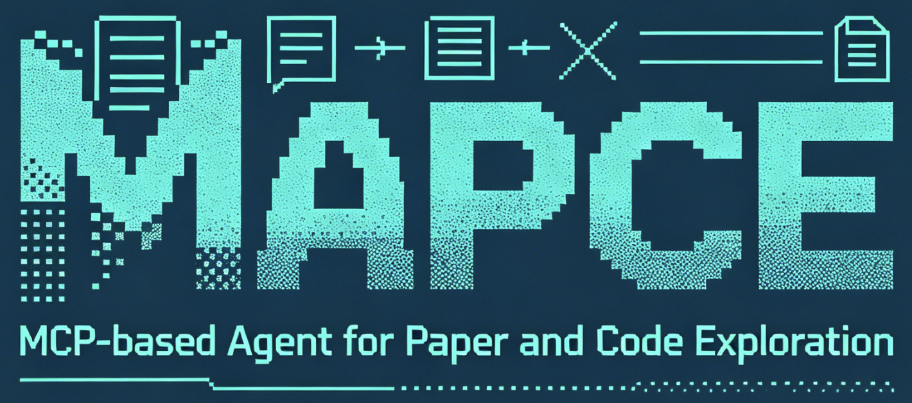

<p align="center">
  
</p>

[English](README_EN.md)

**MAPCE** 是一个面向泛 CS 学术研究的个人 RAG 知识库。支持论文 PDF 解析、代码仓库结构化分块，通过向量+全文混合检索，以 MCP Server 形式为 AI Agent 提供可复用的学术知识检索能力。

> [关于这个项目的bolg](https://kzzzza.github.io/2026/06/09/Tool_agent_paper_research/)

### 适用场景

- 文献调研与 systematic review — 跨论文语义检索，按时间/会议过滤
- 算法实现参考 — 论文方法 ↔ 源代码的双向检索与调用链追踪
- 实验复现辅助 — 表格（benchmark 数据）、图片（架构图）、训练配置的定向检索
- 科研写作 — 快速定位相关工作的具体章节、方法和实验结论

## 安装

- Python ≥ 3.11 · [uv](https://astral.sh/uv) 包管理器 · [MinerU API Token](https://mineru.net/apiManage/token)（免费注册）
- macOS / Linux（推荐 Apple Silicon）· 16 GB 内存 · ~3 GB 磁盘

```bash
# 1. 安装 uv（如未安装）
curl -LsSf https://astral.sh/uv/install.sh | sh

# 2. 进入项目，同步依赖
git clone https://github.com/kzzzza/mapce.git
cd mapce
uv sync

# 3. 配置环境变量
cp .env.example .env
# 编辑 .env，至少填入 MINERU_API_TOKEN
# 中国大陆用户取消代理变量的注释并填入代理地址

# 4. 初始化数据库并下载嵌入模型（仅首次，约 2.1 GB）
uv run --env-file .env python scripts/init_db.py

# 5. 安装为全局工具，并保存默认 .env 路径
uv tool install .
uv tool update-shell  # 仅在 mapce 尚未加入 PATH 时需要
mapce config set-env "$(pwd)/.env"
```

重新打开终端后，可以在任意目录直接运行 `mapce`。`uv tool install` 使用独立的工具环境，因此不会自动读取项目根目录的 `.env`；`config set-env` 只把该文件的绝对路径写入 `~/.mapce/config.json`，不会复制或显示其中的密钥。

```bash
mapce config show       # 查看当前生效的路径，不显示环境变量内容
mapce config unset-env  # 删除保存的路径
uv tool install --reinstall .  # 从项目目录更新全局安装
```

### .env 环境变量

| 变量 | 默认值 | 说明 |
|------|--------|------|
| `MINERU_API_TOKEN` | — | **必填**。MinerU API 密钥 |
| `MAPCE_DATA_DIR` | `~/.mapce/data` | LanceDB 数据目录 |
| `MAPCE_EMBEDDING_MODEL` | `intfloat/multilingual-e5-large` | 嵌入模型（fastembed） |
| `MAPCE_EMBEDDING_CACHE_DIR` | `$MAPCE_DATA_DIR/models/fastembed` | 嵌入模型持久缓存目录 |
| `MAPCE_SERVICE_PORT` | `8765` | 本地单实例后台服务端口，仅监听 `127.0.0.1` |
| `MAPCE_WARMUP_EMBEDDING` | `0` | 是否在服务启动时预加载嵌入模型；默认按需加载 |
| `MAPCE_LOG_LEVEL` | `INFO` | 日志级别 |
| `http_proxy` / `https_proxy` | — | HTTP 代理（国内必填） |

进程中已经设置的环境变量优先级高于 `.env`。高级用法可用 `MAPCE_ENV_FILE` 临时覆盖已保存的 `.env` 路径，或用 `MAPCE_CONFIG_FILE` 覆盖配置文件位置（默认为 `~/.mapce/config.json`）。

### 代理配置（中国大陆用户）

编辑 `.env`，取消注释：

```bash
http_proxy=http://127.0.0.1:9674
https_proxy=http://127.0.0.1:9674
```

保存默认路径后，`mapce`、`mapce-mcp` 和后台服务都会自动加载同一个 `.env`，无需手动 export。开发时仍可使用 `uv run --env-file .env ...` 临时指定环境文件。

### 选择嵌入模型

```bash
# 查看可用模型
uv run python -c "from fastembed import TextEmbedding; print([m['model'] for m in TextEmbedding.list_supported_models()])"
```

## 接入 Claude Code

MAPCE 通过一个本地后台服务集中持有 LanceDB 连接和嵌入模型。同一个 `MAPCE_DATA_DIR` 只运行一个服务；Claude Code 启动的 stdio 进程是轻量代理，会自动启动或复用后台服务。原有基于 `uv run` 的 MCP 配置仍然兼容，全局安装后可改用更短的命令。

全局安装后，在项目根目录创建 `.mcp.json`。将 `/path/to/mapce-mcp` 替换为 `command -v mapce-mcp` 的输出：

```json
{
  "mcpServers": {
    "mapce": {
      "command": "/path/to/mapce-mcp",
      "args": []
    }
  }
}
```

重启 Claude Code，批准 MAPCE 服务器后即可自然语言交互：

> 搜索关于 diffusion policy 在机器人控制中的应用的论文
>
> 这篇论文有对应的开源代码吗？帮我索引
>
> 检索 transformer 架构中关于 attention 机制的相关论文和代码

### 后台服务管理

```bash
mapce serve          # 启动或复用后台服务
mapce serve-status   # 查看 PID、端口和模型加载状态
mapce serve-logs     # 查看日志路径
mapce serve-kill     # 在安全点正常停止
mapce serve-restart  # 重启服务
```

退出 MCP 客户端不会停止后台服务。只有 `serve-kill` 会请求停止；`serve-kill --force` 只用于已经通过健康检查验证身份的准确进程。

## 科研工作流 Skills

MAPCE 附带六个可安装 Skill，用于论文发现、单篇深读、文献综述、实验设计和科研写作。Skill 通过 MCP 使用同一个后台服务，不会直接打开 LanceDB，也不会在 Agent 进程中重复加载嵌入模型。

```bash
mapce skills list
mapce skills install --target codex
mapce skills install --target claude
mapce skills install --target agents
# 其他 Agent 使用自定义目录
mapce skills install --path /path/to/agent/skills
```

安装采用复制和校验值保护。重复安装相同版本不会产生变化；升级使用 `--update`，检测到用户修改时会停止并返回冲突文件。研究笔记和论文草稿默认写入实际工作目录的 `research/<项目名>/`，写入前由 Agent 询问用户是否采用该目录。

完整工作流、产物结构和证据状态说明见 [docs/research-skills.md](docs/research-skills.md)。

## 终端数据库管理界面

不带子命令运行 `mapce` 会打开 Textual TUI。它只通过同一个本地后台服务访问数据库，不会在界面进程中加载 LanceDB 或嵌入模型。

```bash
mapce
```

界面包含总览、论文库、索引、任务和系统五个页签。论文库使用带序号的单页滚动表格，可按发表年份、入库时间、标题、Paper ID、Chunk 数量或代码状态排序，并支持内部 ID/arXiv 编号精确查找。界面还可查看论文与代码状态、提交索引/删除任务、审核候选仓库、查看日志和诊断后台。按 `q` 退出界面不会停止后台服务。

需要脚本化管理时，可使用 `mapce papers`、`mapce search`、`mapce index`、`mapce jobs`、`mapce stats` 和 `mapce doctor`；各子命令可通过 `--help` 查看参数。

## 文档索引

| 文档 | 内容 |
|------|------|
| [docs/usage.md](docs/usage.md) | TUI/CLI、Python SDK、MCP 工具参考（12 个）、论文深度读取与 Agent 集成 |
| [docs/data-sources.md](docs/data-sources.md) | 数据源适配器（arXiv、Zotero、本地 PDF、目录批量） |
| [docs/storage.md](docs/storage.md) | 存储形式：LanceDB、模型缓存、临时文件、清理 |
| [docs/troubleshooting.md](docs/troubleshooting.md) | 常见问题与解决方案 |
| [docs/development.md](docs/development.md) | 开发指南（架构、分块策略、项目结构、添加数据源） |
| [docs/research-skills.md](docs/research-skills.md) | 科研工作流 Skill 安装、论文发现、证据台账、综述与写作 |

## MAPCE TODO

- [x] **论文检索广度与内存安全**：加入向量与全文混合召回，按论文去重并返回最佳证据片段；使用 IVF-PQ 索引、连接复用和按需加载嵌入模型，降低重复检索与多个 MCP 进程带来的内存占用
- [x] **论文—代码仓库关联**：论文状态与代码状态分离，支持一篇论文关联多个仓库、自动发现官方仓库、记录待审核候选，并明确标记未发现代码仓库的论文
- [ ] **代码检索排序**：当前代码文件 `Recall@5` 基线约为 0.65。后续需要融合仓库、文件路径、代码符号和调用关系等信号，并为不同编程语言建立更细的评测集
- [ ] **代码分析增强**：Python 使用 AST 解析，C++/CUDA 仍依赖正则，暂不能可靠处理模板元编程和复杂宏展开。后续考虑接入 Tree-sitter 或语言服务器，并支持 Makefile、Dockerfile、Shell 等文件
- [ ] **自动更新机制**：检测 arXiv 新版本和代码仓库新 commit，先展示变化，再由用户确认是否增量同步；同时加入辅助索引刷新和失败任务重试
- [x] **终端管理界面**：提供轻量 Textual TUI，用于论文状态浏览、arXiv 精确查找、索引任务、候选仓库审核、删除确认、后台日志和系统诊断；TUI、CLI 与 MCP 共用单一后台服务
- [x] **科研工作流 Skills**：提供论文发现、单篇深读、快速或 PRISMA 式综述、实验设计和证据约束写作；支持安装到多种 Agent，并在索引新论文前要求用户确认
- [ ] **Zotero 深度集成**：在 PDF 导入之外，同步 Zotero 笔记、标签和集合，或提供 Zotero Agent 插件

## 许可

[MIT](LICENSE)
